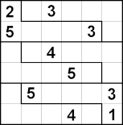
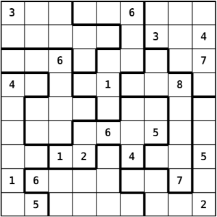

---
title: Devoir noté 2 -- Sudoku Solver
author: Jean-Cédric Chappelier &  Merlin Nimier-David
date: Version 1.0 du 10 mai
header-includes: |
    ```{=latex}
    \usepackage[french]{babel}
    \usepackage{pmboxdraw}
    \catcode`\^^^^2550=\active
    \catcode`\^^^^2551=\active
    \catcode`\^^^^2554=\active
    \catcode`\^^^^2557=\active
    \catcode`\^^^^255a=\active
    \catcode`\^^^^255d=\active
    \def^^^^2550{\pmboxdrawuni{2550}}
    \def^^^^2551{\pmboxdrawuni{2551}}
    \def^^^^2554{\pmboxdrawuni{2554}}
    \def^^^^2557{\pmboxdrawuni{2557}}
    \def^^^^255a{\pmboxdrawuni{255A}}
    \def^^^^255d{\pmboxdrawuni{255D}}
    ```
...

(du 10 mai 2021, 12h00, au 25 mai, 23h59.)


# I. Introduction et instructions générales

Ce devoir noté consiste à écrire les parties manquantes d'une petite application de résolution naïve (« force brute ») de grilles de Sudoku généralisées (formes quelconques, expliqué ci-dessous).

Nous vous demandons d'écrire tout votre code dans _un seul_ fichier nommé `sudoku.c` sur la base d'un fichier fourni, à compléter.

**Indications :** Si un comportement ou une situation donnée n'est pas définie dans la consigne ci-dessous, vous êtes libre de définir le comportement adéquat. On considérera comme comportement adéquat toute solution qui ne viole pas les contraintes données et qui ne résulte pas en un crash du programme.

**Instructions :**

1. Cet exercice doit être réalisé **individuellement !**
L'échange de code relatif à cet exercice noté est **strictement interdit !**
Cela inclut la diffusion de code sur le forum ou sur tout site de partage.

    Le code rendu doit être le résultat de _votre propre production_.
    Le plagiat de code, de quelque façon que de soit et quelle qu'en soit la source sera considéré comme de la tricherie (et peut même, suivant le cas, être illégal et passible de poursuites pénales).

    En cas de tricherie, vous recevrez la note « NA » pour l'entièreté de la branche et serez de plus dénoncés et punis suivant l'ordonnance sur la discipline.

2. Vous devez donc également garder le code produit pour cet exercice dans un endroit à l'accès strictement personnel.

3. Veillez à rendre du code _anonyme_ : **pas** de nom, ni de numéro SCIPER, ni aucun identifiant personnel d'aucune sorte !

4. Utilisez le site Moodle du cours pour rendre votre exercice.

    Vous avez jusqu'au mardi 25 mai, 23:59 (heure du site Moodle du cours faisant foi) pour soumettre votre rendu.
    **Aucun délai supplémentaire ne sera accordé.**

Je tiens également à souligner que l'objectif de ce devoir n'est pas tant de vous évaluer que de vous entraîner. C'est pour cela que le coefficient de ce devoir est assez faible (15%). Utilisez le donc comme un entraînement indicatif (sur lequel vous aurez un retour) en travaillant à votre niveau dans une durée qui vous semble raisonnable pour les crédits de ce cours (au lieu d'essayer de tout faire dans un temps déraisonnable). Ce coefficient (3 sur 20) n'est pas représentatif de la charge de travail (qui peut beaucoup varier à ce niveau d'un(e) étudiant(e) à l'autre), mais bien pour vous donner l'occasion d'avoir un deuxième retour sur votre niveau de programmation en C, sans prendre trop de « risques ».


# II. Contexte

## II.1 Cadre général

Comme dit en introduction, le but du programme complet sera de résoudre, avec un algorithme de recherche systématique (« force brute ») fourni, une grille de Sudoku « généralisée » saisie en entrée. Une telle grille peut être un carré 9x9 comme on les trouve habituellement, ou carré 4x4 (chiffres de 1 à 4) avec 4 régions carrées 2x2, ou encore carré _n_ par _n_  avec des régions internes non carrées, mais ayant toute la même taille, laquelle correspond à la taille de l'alphabet. Voici p.ex. une telle grille 6x6 (chiffres de 1 à 6, donc) avec des régions non-standard :


(© CC BY-SA 3.0 JosuéJacob (alias Skratt))

Voici un autre exemple avec des régions de taille 9 non carrées :



Pour plus de détails sur ces Sudoku, vous pouvez aller voir [la page « Sudoku » de Wikipédia](https://fr.wikipedia.org/wiki/Sudoku) et plus spécifiquement [sa section « Variantes »](https://fr.wikipedia.org/wiki/Sudoku#Variantes).

Chaque case de la grille est donc contrainte par sa ligne, sa colonne et sa région (qui peut être de forme quelconque).

## II.2 Exemple de déroulement

La grille à résoudre par le programme sera fournie en entrée dans un format spécifique que nous n'allons pas détailler ici car il est déjà traité par le programme fourni. Mais pour illustrer concrètement les choses, voici un exemple de déroulement attendu du programme une fois terminé, correspondant à la résolution de la grille 6x6 illustrée plus haut :

Entrée :
```
6 1
2.3...
5...3.
..4...
...5..
.5...3
...4.1
0 1 1 1 1 1
0 0 0 0 0 1
2 3 3 3 3 3
2 2 2 2 2 3
4 5 5 5 5 5
4 4 4 4 4 5
```

Sortie :
```
~~~~~~ Initial ~~~~~~
╔═════════════╗
║ 2 . 3 . . . ║
║ 5 . . . 3 . ║
║ . . 4 . . . ║
║ . . . 5 . . ║
║ . 5 . . . 3 ║
║ . . . 4 . 1 ║
╚═════════════╝
~~~*~~ Solved! ~~*~~~
╔═════════════╗
║ 2 6 3 1 5 4 ║
║ 5 4 1 6 3 2 ║
║ 6 1 4 3 2 5 ║
║ 4 3 2 5 1 6 ║
║ 1 5 6 2 4 3 ║
║ 3 2 5 4 6 1 ║
╚═════════════╝
```

## II.3 Conception

Au niveau de la conception, un Sudoku est donc une grille carrée de _n_ fois _n_ cellules ayant chacune des contraintes et un ensemble de valeurs candidates. Dans une cellule dont la valeur est connue au départ, l'ensemble des valeurs candidates est bien sûr réduit à une seule valeur ; et dans une cellule inconnue, l'ensemble des valeurs candidates est, au départ avant résolution, constitué des _n_ chiffres de 1 à _n_ (_n_ sera compris entre 2 et 9 pour notre programme).

Le but de la résolution est de réduire, si c'est possible, l'ensemble des valeurs candidates à une seule valeur dans chaque cellule, tout en respectant les contraintes.

Les contraintes d'une cellule sont représentées par un tableau de références (pointeurs en C) vers les autres cellules qui la contraignent : ses voisines de ligne, de colonne, et de région.

Nous appellerons « `Region` » un tel tableau de pointeurs vers des cellules.
Ce terme regroupera donc à la fois des cellules de la même ligne, de la même colonne et de la même région au sens du Sudoku.

## II.4 Algorithme de résolution

L'algorithme de résolution utilisé (fonction `backtracking_solver()` dans le code fourni) est un algorithme récursif assez simple dont  les grandes étapes sont :

1. dans chaque cellule, éliminer les valeurs candidates qui ne sont pas compatibles avec ses contraintes ;
    répéter ceci jusqu'à ce que la grille ne change plus ; si le nombre de valeurs candidates d'une cellule tombe à zéro, alors la grille ne peut pas être résolue (et on s'arrête là) ;
2. trouver la cellule non résolue (ayant plus que une valeur candidate) qui a le moins de valeurs candidates ;
3. fixer arbitrairement une valeur candidate pour cette cellule et récursivement essayer de résoudre la grille (étape 1) ;
    si la grille n'a pas de solution une fois cette valeur candidate fixée, revenir à l'état précédent (« _backtracking_ ») et essayer la valeur candidate suivante (étape 3).

Les choix de structure de données, l'organisation du code et les fonctions outils permettent l'application de cet algorithme.


# III. Implémentation

Le fichier `sudoku.c` fourni contient un certain nombre de fonctions, dont certaines que nous vous demandons de compléter.
C'est un programme conséquent dont la plus grande partie est déjà fournie (commencez peut-être par jeter juste un coup d'oeil au fichier fourni pour avoir une idée). Cela fait aussi pleinement partie des objectifs de ce devoir que de vous « faire entrer » dans du code fourni (vous aurez aussi à faire cela dans certains de vos futurs cours).

Ce que vous avez à faire c'est :

1. implémenter trois structures de données adaptées à ce problème ;
2. écrire deux « macros » ;
3. compléter la définition de sept « fonctions outils ».

Nous vous conseillons de procéder par étapes et tester régulièrement votre code.
Par ailleurs, inspirer vous aussi du code fourni pour savoir plus précisément ce que vous avez à faire. La présente donnée n'est pas nécessaire exhaustive (ce serait fastidieux pour vous comme pour nous) et **le code fourni fait pleinement partie de la donnée**, en tant qu'explication complémentaire.
Par exemple, choisissez des noms de champs de vos structures qui soient compatibles avec le code déjà écrit ; ou, sachez utilisez les fonctions outils déjà fournies.

Votre rendu **ne doit pas modifier le code fourni**. En revanche, n'hésitez pas à y ajouter temporairement des affichages ou vérifications supplémentaires pendant le développement pour aider votre compréhension.


## III.1 Types de données

Vous devez définir (au moins) les trois types suivants (pas nécessairement dans cet ordre) :

- `Cell`, représentant les cellules du Sudoku ; elles contiennent :
    + une `Region` (nommée `constraints`) ;
    + un ensemble de valeurs candidates, stocké sous la forme d'une chaîne de caractères ;
    p.ex. une cellule n'ayant plus que 2, 5 et 9 comme valeurs candidates aura ici la chaîne (au sens du C) `"259"` (pas nécessairement dans cet ordre ; en fonction du parcours de l'algorithme, ce pourrait aussi être n'importe quelle permutation, comme p.ex. `"592"`) ;
    + le nombre de valeurs candidates ; ceci pour avoir un accès plus rapide à ce nombre (mais il est clair qu'à tout moment ce nombre est égal à la longueur de la chaîne des valeurs candidates) ;

- `Region`, un « tableau dynamique » de pointeurs sur des cellules ; par « tableau dynamique », nous entendons ici que ce tableau sera alloué dynamiquement sur « le tas » (« _heap_ »), une fois pour toute au départ ; néanmoins, sa taille est connue (voir la macro `number_of_constraints` plus bas) et fixe une fois la grille entrée ; on ne stocke donc pas cette taille dans `Region` (qui en est, du coup, d'autant simplifié) ;

- `Sudoku`: un « tableau dynamique » de cellules ; nous entendons à nouveau ici par « tableau dynamique » un tableau alloué dynamiquement sur « le tas » (« _heap_ »), une fois pour toute au départ et dont la taille ne varie plus par la suite ; par contre, le type `Sudoku` contiendra la taille _n_ (nommée aussi `n`) de son alphabet (9 dans le cas classique) ; le tableau lui-même, bien que carré, sera implémenté de façon continue (à une seule dimension) : le programme gérera lui-même (via la fonction `get_cell()` décrite ci-dessous) la pagination de cet espace mémoire continu.


## III.2 Macros

**Note :** vous pouvez, mais il n'est pas forcément nécessaire d'écrire ces deux macros juste après avoir défini les types ; vous pouvez aussi les écrire au moment où vous estimez en avoir besoin. **[fin de note]**

Définissez (aux endroits indiqués) les deux « macros » suivantes :

- `number_of_constraints`, qui prend un argument correspondant à un `Sudoku` et qui vaut l'expression $3 \times (n - 1),$ où $n$ est le `n` du `Sudoku` ;

- `round`, qui prend deux arguments correspondants à des entiers (positifs) et retourne le plus grand multiple du second nombre, qui soit inférieur ou égal au premier nombre ; p.ex.
`round(2, 3)` vaut `0`,
`round(3, 3)` vaut `3`,
et `round(7, 3)` vaut `6` ; ceci correspond au second nombre multiplié par le quotient du premier et du second nombre ; cette valeur est intéressante pour trouver les coordonnées de la cellule du coin d'une région dans un Sudoku usuel _n_ x _n_ (_n_ valant 4 ou 9) et donc pour en fixer les contraintes ; p.ex. dans un Sudoku usuel 9x9, les coordonnées (façon C) de la région contraignant la cellule $(2, 7)$ sont $(0, 6)$.


## III.3 Fonctions à implémenter

Comme souvent, la plupart des fonctions à implémenter retournent un `int` indiquant son succès (`1`) ou son échec (`0`). Prenez garde à correctement indiquer et gérer les cas d'erreur, y compris en ce qui concerne la mémoire allouée dynamiquement.

**Note :** nous décrivons ici les fonctions dans l'ordre dans lequel elle apparaissent dans le fichier fourni, mais il n'est pas forcément nécessaire de les écrire dans cet ordre ; libre à vous de les écrire dans l'ordre que vous voulez, p.ex. au moment où vous estimez en avoir besoin. **[fin de note]**

### `get_cell()`

Cette fonction doit retourner (un pointeur sur) la cellule située en coordonnées (`i`, `j`). Il est impératif ici que vous utilisiez **l'arithmétique des pointeurs** pour écrire _la_ ligne qui manque.

(Vous êtes libres d'organiser la mémoire du Sudoku comme vous voulez ; c'est  justement pour cette raison que cette fonction existe !)

### `set_cell_constraints()`

Lors de la création d'une grille de Sudoku (fonction `create()`), le rôle de cette fonction est d'assembler toutes les contraintes (ligne, colonne, région) pour la cellule `(ci, cj)` et de les stocker dans cette cellule.

Chaque cellule est contrainte par les autres cellules présentes sur sa ligne, sa colonne, et dans sa « région ». L'argument `custom_regions` est optionnel : s'il n'est pas fourni (valeur `NULL`), il faut utiliser les régions carrées standard (2x2 ou 3x3 ;
pensez alors à la « macro » `round`).

S'il est fourni, il prendra la forme suivante (voir la grille de test 6x6 fournie et la fonction `read_grid()`) :
un tableau linéarisé d'indices, de la même taille que la grille. Chaque entrée `(i * n + j)` de ce tableau donne le numéro de la région à laquelle la cellule `(i, j)` appartient.

Une fois ce numéro de région obtenu, vous devez ajouter aux contraintes toutes les cellules appartenant à cette même région.

Par exemple, dans l'exemple de déroulement donné en section II.2 pour la grille 6x6, on peut voir que la cellule (1, 5), au bout de la seconde ligne, appartient à la région « 1 ». On devra donc (en plus des autres cellule la ligne 1 et celles de la colonne 5) ajouter les cellules (0, 1), (0, 2), (0, 3), (0, 4) et (0, 5), car elles font toutes aussi partie de la région « 1 ».

A noter qu'on pourra ajouter une même contrainte (c.-à-d. une même cellule) plusieurs fois, typiquement lorsqu'elle fait partie de l'intersection d'une ligne ou d'une colonne et d'une région. Par exemple, la cellule (0, 5) sera ajoutée 2 fois dans l'exemple ci-dessus : par la colonne et par la région.

(Si l'on recherchait les doublons à chaque fois, on aurait un algorithme de complexité plus grande en raison de la recherche linéaire systématique.)

### `create()`

Cette fonction, utilisée par `read_grid()`, alloue et initialise une grille de Sudoku de taille `n`. Les valeurs candidates et les contraintes de chaque cellule doivent être initialisées. À la fin de cette fonction, la grille doit être prête à être résolue par `backtracking_solver()`.

Les valeurs initiales de chaque cellule sont données dans `initial_values`, qui est un tableau de `n` chaînes de caractères, chacune de taille supérieure ou égale à `n` et correspondant chacune à une ligne du Sudoku. Par exemple, dans l'exemple de déroulement donné en section II.2 pour la grille 6x6, ce tableau serait :

```c
{ "2.3...",
  "5...3.",
  "..4...",
  "...5..",
  ".5...3",
  "...4.1" }
```

Tous les espaces (au sens de `isspace()`) dans ces chaînes de caractères doivent être ignorés (il peut y en avoir un nombre quelconque n'importe où). Un caractère (non espace et) non valide (voir `is_valid_char()`), comme p.ex. les `'.'` ci-dessus, indique que cette case est initialement vide, et donc tous les caractères de `'1'` au caractère représentant la valeur de `n` sont donc candidats. Et sinon, c'est qu'un caractère valide est donné et devra être traduit en l'unique valeur candidate pour cette cellule.

Pensez à utiliser les fonctions outil déjà crées et gérer avec attention les allocations dynamiques en cas d'erreur.


### `create_shallow_backup()`

L'algorithme de recherche utilisé (voir section II.4) est récursif et doit pour cela utiliser des copies « de réflexion » de la grille qu'il cherche à résoudre (afin de ne pas perturber les recherches en cours). Il a pour cela besoin de deux « fonctions outils » :
`create_shallow_backup()`, qui crée une copie (relativement profonde, comme expliqué ci-dessous), et `restore_shallow_backup()`, qui restore une telle copie.

À l'étape (3) de l'algorithme (cf section II.4), une valeur candidate est fixée tentativement avant d'essayer de résoudre la grille récursivement. En cas d'échec, il faut revenir à l'état initial afin de pouvoir essayer la valeur candidate suivante.

La fonction `create_shallow_backup()` doit donc sauvegarder, pour chaque cellule, l'état complet des candidats (nombre et ensemble des valeurs) dans une grille temporaire `out`.

En revanche, les contraintes n'ont pas besoin d'être sauvegardées car elles ne sont pas modifiées pendant l'appel récursif (une telle sauvegarde de pointeurs aurait par ailleurs été difficile à implémenter de façon robuste).

**Attention :** la grille de sauvegarde `out` n'est pas initialisée avant le passage à `create_shallow_backup()`. Réfléchissez à la bonne manière d'initialiser ses différents champs, sachant que cette grille finira par être détruite avec `release()`.


### `restore_shallow_backup()`

Restaure l'état de la grille, tel que sauvegardé par `create_shallow_backup()`.


### `update_candidates()`

Au cours de la résolution (étape 1, voir section II.4), les valeurs candidates de chaque cellule doivent être éliminées progressivement en appliquant ses contraintes.

Pour une cellule à mettre à jour et une contrainte donnée, la fonction `update_candidates()` doit mettre à jour la liste des valeurs candidates si cette liste contient la valeur interdite par la cellule contraignante (une telle « cellule contraignante » ne contraint que par sa _première_ valeur « candidate »).

Si une contrainte élimine le dernier candidat possible de la cellule en cours, alors la grille n'a pas de solution (indiqué par une valeur de retour de `0`).

Le paramètre `has_changed` doit être mis à `1` **uniquement** cas de changement de la cellule (voir si nécessaire son utilisation dans `backtracking_solver()`).


### `get_line()`

La fonction de lecture de l'entrée (grille de Sudoku) utilise une « fonction outil » permettant de lire _dynamiquement_ une ligne sur l'entrée standard. En effet, la fonction `fgets()` de la bibliothèque standard ne lit qu'un nombre _maximum_ de caractères fixé à l'avance. Mais il est en général difficile de savoir quelle sera la longueur d'une ligne donnée, en particulier dans notre programme qui autorise un nombre quelconque de blancs pour séparer les valeurs entrées.

Le but de la fonction `get_line()` est donc d'allouer dynamiquement et lire progressivement une ligne (sur l'entrée standard) en appliquant une stratégie de croissance exponentielle : elle commence à allouer un « tampon » (« _buffer_ ») à une taille initiale donnée (p.ex. 32) et lire au maximum autant de caractère (tant qu'il n'y a pas de retour à la ligne, bien sûr !), puis, si elle n'a pas lu de retour à la ligne, elle ré-alloue son tampon à une taille double (ce serait donc 64 dans cet exemple) et continue à lire des caractères ; et elle procède ainsi de suite, en doublant à chaque fois la taille de son tampon, tant quelle ne lit pas de retour à la ligne.

Enfin, elle ré-alloue (si nécessaire vers le bas) son tampon de sorte qu'il ait exactement la bonne taille pour contenir la chaîne lue, **sans** son retour à la ligne.

En sortie, le pointeur `where` pointe sur la chaîne lue (sans le retour à la ligne) et `how_many` contient le nombre de caractères lus (sans le retour à la ligne).

Il faudra bien sûr veiller aux cas d'erreurs (auxquels cas, `where` contient `NULL` et
`how_many` contient 0).

# V. Quelques conseils pour terminer

N'hésitez pas à créer d'autres fonctions utilitaires si nécessaire et à utiliser celles existantes.

Tout votre code et toutes vos fonctions doivent être robustes tant que faire se peut.

Pensez à tester correctement chacune des fonctionnalités implémentées à **chaque** étape et **avant** de passer à l'étape suivante. Cela vous évitera bien des tracas.

Pour tester efficacement un exemple sans avoir à entrer les données à la main à chaque essai, vous pouvez utiliser la redirection de flux, p.ex. :

    ./sudoku < tests/6x6-1.txt
